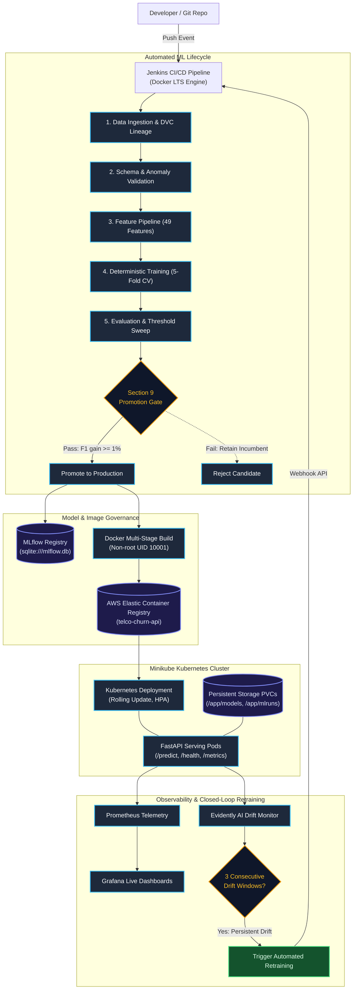
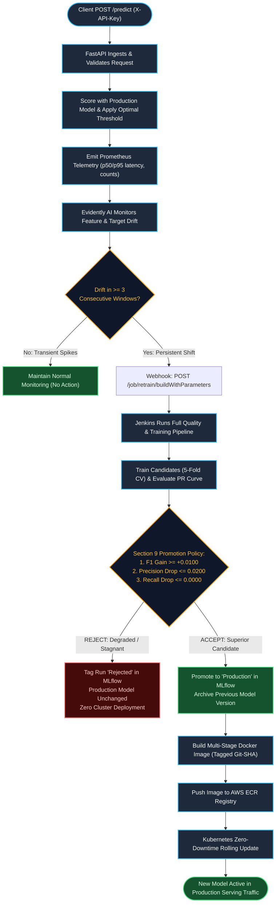

# Telco Customer Churn MLOps Platform

> **An end-to-end, production-grade Machine Learning Operations (MLOps) platform featuring automated data lineage, deterministic model training, MLflow governance, containerized FastAPI serving, Kubernetes orchestration, Prometheus/Grafana observability, Evidently AI drift monitoring, and closed-loop automated retraining.**

---

[](https://www.python.org/)
[](https://fastapi.tiangolo.com/)
[](https://mlflow.org/)
[](https://www.docker.com/)
[](https://kubernetes.io/)
[](https://www.jenkins.io/)
[](https://prometheus.io/)
[](https://grafana.com/)
[](https://aws.amazon.com/ecr/)
[](https://github.com/psf/black)
[](http://mypy-lang.org/)
[](tests/)

---

## Table of Contents

- [1. Project Overview](#1-project-overview)
- [2. Problem Statement](#2-problem-statement)
- [3. What Makes This Project Different](#3-what-makes-this-project-different)
- [4. Project Objectives](#4-project-objectives)
- [5. Solution Overview](#5-solution-overview)
- [6. High-Level Architecture](#6-high-level-architecture)
- [7. Detailed System Architecture](#7-detailed-system-architecture)
- [8. End-to-End System Flow](#8-end-to-end-system-flow)
- [9. Problem → Technology → Solution Mapping](#9-problem--technology--solution-mapping)
- [10. Technology Stack](#10-technology-stack)
- [11. Dataset](#11-dataset)
- [12. Data Pipeline](#12-data-pipeline)
- [13. Feature Engineering](#13-feature-engineering)
- [14. Model Training](#14-model-training)
- [15. Model Results](#15-model-results)
- [16. Threshold Optimization](#16-threshold-optimization)
- [17. MLflow Model Governance](#17-mlflow-model-governance)
- [18. FastAPI Prediction Service](#18-fastapi-prediction-service)
- [19. Docker Architecture](#19-docker-architecture)
- [20. Kubernetes Architecture](#20-kubernetes-architecture)
- [21. CI/CD Architecture](#21-cicd-architecture)
- [22. Monitoring and Observability](#22-monitoring-and-observability)
- [23. Drift Detection](#23-drift-detection)
- [24. Automatic Retraining](#24-automatic-retraining)
- [25. Security Architecture](#25-security-architecture)
- [26. Reliability and Safety Mechanisms](#26-reliability-and-safety-mechanisms)
- [27. Integration Testing](#27-integration-testing)
- [28. Final Verification](#28-final-verification)
- [29. Project Journey / Phase Roadmap](#29-project-journey--phase-roadmap)
- [30. Repository Structure](#30-repository-structure)
- [31. Installation](#31-installation)
- [32. Run the Project](#32-run-the-project)
- [33. Temporary Public Demo Setup](#33-temporary-public-demo-setup)
- [34. Known Limitations](#34-known-limitations)
- [35. Cloud Production Architecture — Future Roadmap](#35-cloud-production-architecture--future-roadmap)
- [36. Cost Philosophy](#36-cost-philosophy)
- [37. Documentation Links](#37-documentation-links)
- [38. Author](#38-author)
- [39. License](#39-license)
- [40. Summary](#40-summary)

---

## 1. Project Overview

The **Telco Customer Churn MLOps Platform** is a complete, automated software and machine learning system engineered to predict telecommunication customer churn, serve low-latency online predictions, monitor model health in real-time, detect statistical data drift, and safely trigger automated retraining and deployment without manual downtime or unverified model promotion.

Spanning **20 distinct engineering phases**, the project implements the complete ML lifecycle as robust software: from raw data validation and DVC tracking to multi-stage Docker builds, Kubernetes manifests on Minikube, Jenkins CI/CD automation, Prometheus/Grafana telemetry, and closed-loop retraining via an MLflow promotion gate.

---

## 2. Problem Statement

### The Business Reality
Customer churn is one of the highest cost drivers in the telecommunications industry. Acquiring a new customer costs 5 to 7 times more than retaining an existing one. Early detection of churn risk allows retention teams to intervene with targeted promotions, contract adjustments, or proactive customer support.

### The Engineering Challenges
Training a machine learning model in a Jupyter Notebook does not solve customer churn in an enterprise. Real-world machine learning fails due to:
1. **Data Leakage & Inconsistency**: Preprocessing transformations fitted across entire datasets leak test distribution into training data, yielding over-optimistic validation metrics that collapse in production.
2. **Silent Data & Concept Drift**: Customer behavior, competitor pricing, and macroeconomic conditions change over time. Models silently degrade without producing HTTP or runtime errors.
3. **Uncontrolled Model Deployment**: Ad-hoc model replacement can accidentally promote an overfitted or degenerate model to production, causing financial loss.
4. **Lack of Provenance & Lineage**: When a prediction fails or produces unexpected results, engineers must trace the exact dataset checksum, git commit, hyperparameters, and feature transformations that produced that model artifact.
5. **Observability Blind Spots**: Traditional backend monitoring (CPU, RAM) cannot observe machine learning health (probability calibration drift, prediction distribution shifts, latency percentiles).

This project treats machine learning as a **disciplined software engineering system** to solve these operational problems.

---

## 3. What Makes This Project Different

| Lifecycle Stage | Traditional "Notebook" ML | This MLOps Platform |
| :--- | :--- | :--- |
| **Data Ingestion** | Manual CSV download | SHA-256 integrity verification + DVC versioning |
| **Validation** | Ad-hoc pandas exploratory analysis | Strict Pydantic domain rules + anomaly detection report |
| **Feature Pipeline** | Ad-hoc pandas functions on full dataset | Train-only fitted Scikit-Learn `ColumnTransformer` + 49-feature schema lock |
| **Training** | Single arbitrary train/test split | 5-fold Stratified CV + hyperparameter random search (`seed=42`) |
| **Evaluation** | Default 0.5 threshold accuracy | PR-curve threshold optimization + Brier score calibration analysis |
| **Governance** | Unversioned `.pkl` files on local disk | SQLite-backed MLflow Registry with deterministic Section 9 promotion gate |
| **Serving** | Local Flask demo / Jupyter cell | Production FastAPI + SlowAPI rate limiting + API-Key authentication + non-root container |
| **Deployment** | Manual script execution | Kubernetes Deployment + Service + PVCs + HPA + Zero-Downtime Rolling Update |
| **CI/CD** | None | Declarative multi-stage `Jenkinsfile` orchestrating tests, builds, and rollouts |
| **Telemetry** | Basic application logs | Real-time Prometheus metrics (histograms, counters) + Custom Grafana dashboards |
| **Drift & Retraining** | Retrain manually when complaints arrive | Automated Evidently AI drift monitoring + 3-window dampening + Jenkins webhook trigger |

---

## 4. Project Objectives

1. **Deterministic Reproducibility**: Guarantee identical data splits, feature transformations, hyperparameter ranking, and evaluation metrics using fixed random seeds and strict schema enforcement.
2. **Zero-Leakage Feature Engineering**: Enforce that feature imputers and derived encoders are fit strictly on training splits and serialized alongside the model.
3. **Deterministic Governance & Safety Gates**: Implement an automated model promotion gate requiring measurable F1 improvements ($\ge 1\%$), bounded precision drops ($\le 2\%$), and non-decreasing recall before any artifact is marked as `Production`.
4. **High-Performance Serving**: Deliver an asynchronous FastAPI REST prediction endpoint with Pydantic validation, structured JSON logging, and security controls.
5. **Production-Grade Orchestration**: Package services in hardened multi-stage Docker containers and orchestrate deployments via Kubernetes manifests on Minikube with persistent volume claims.
6. **Continuous Observability**: Instrument inference requests with Prometheus metrics and visualize operational and ML telemetry on Grafana.
7. **Closed-Loop Retraining**: Automatically detect feature/prediction drift across consecutive windows, trigger the CI/CD pipeline via Jenkins REST API, and conditionally deploy newly trained models only if they surpass incumbent production metrics.

---

## 5. Solution Overview

The solution consists of seven interconnected software subsystems:
- **Data Ingestion & Integrity**: Fetches raw data, validates SHA-256 checksums, and tracks state using DVC.
- **Validation & Transformation**: Validates 21 raw columns against schema bounds, imputes whitespace values in `TotalCharges`, and generates 49 engineered numerical and one-hot features.
- **Deterministic Training & Evaluation**: Tunes XGBoost and Logistic Regression candidates using 5-fold Stratified Cross-Validation, optimizes classification decision thresholds along the Precision-Recall curve ($\approx 0.2872$), and computes Brier score calibration.
- **MLflow Model Registry**: Maintains artifact lineage, tracking runs, parameters, metrics, and lifecycle stages (`Staging`, `Production`, `Archived`).
- **Containerized FastAPI Service**: Runs in a non-root Alpine/Debian-slim container, authenticating clients via `X-API-Key` and serving low-latency predictions.
- **Kubernetes & Cloud Registry**: Deploys pods on Minikube with PVC mounts for persistent models and pushes immutable git-SHA tagged images to AWS ECR.
- **Telemetry, Drift & Retraining Loop**: Scrapes Prometheus metrics, visualizes performance in Grafana, evaluates population drift via Evidently AI over 3 consecutive windows, and triggers automated Jenkins retraining.

---

## 6. High-Level Architecture



---

## 7. Detailed System Architecture

### 7.1 Data Layer
- **Ingestion (`src/data/ingestion.py`)**: Fetches raw data from remote or local storage, validates SHA-256 checksums to guarantee uncorrupted inputs, and tracks datasets via DVC (`.dvc`).
- **Validation (`src/data/validation.py`)**: Validates 21 raw columns against strict type schemas, verifies categorical allowable sets, flags whitespace anomalies in `TotalCharges`, and generates structured JSON validation reports.
- **Feature Engineering (`src/data/features.py`)**: Scikit-Learn `ColumnTransformer` containing custom imputers and derived feature transformers (`charge_ratio`, `tenure_years`, `is_monthly_contract`, `has_internet`). Fitted strictly on training data (`X_train`) to prevent data leakage and serialized to `models/feature_pipeline.joblib`.

### 7.2 ML Layer
- **Training (`src/training/train.py`)**: Deterministic training using 5-fold Stratified Cross-Validation across candidate algorithms (XGBoost Classifier and Logistic Regression) with `RandomizedSearchCV` (`random_state=42`).
- **Evaluation (`src/training/evaluate.py`)**: Generates classification reports, confusion matrices, ROC-AUC curves, Precision-Recall curves, Brier score calibration curves, and feature importance rankings.

### 7.3 Model Governance Layer
- **MLflow Tracking & Registry (`src/training/promotion.py`)**: SQLite-backed registry (`sqlite:///mlflow.db`) and local artifact store (`mlruns/`). Models are logged with complete parameters, metrics, feature schema, and dataset hash tags.
- **Section 9 Promotion Policy**: Evaluates candidate models against incumbent production models using deterministic promotion criteria before updating registry stages (`Staging` $\to$ `Production` $\to$ `Archived`).

### 7.4 Serving Layer
- **FastAPI Application (`src/api/`)**: High-performance asynchronous REST API (`src/api/app.py`, `routes.py`, `schemas.py`) validating incoming requests with Pydantic v2.
- **Security & Middleware (`src/api/security.py`)**: Validates incoming `X-API-Key` headers against hashed secret lists, enforces SlowAPI client rate limits (60 req/min), and emits non-PII structured JSON logs.

### 7.5 Infrastructure Layer
- **Containerization (`Dockerfile`, `docker-compose.yml`)**: Multi-stage Docker build producing an optimized runtime image executing under an unprivileged `appuser` (UID 10001).
- **Orchestration (`infra/k8s/`)**: Declarative Kubernetes manifests for Minikube including `Deployment`, `Service` (NodePort), `ConfigMap`, `Secret`, Persistent Volume Claims (`telco-models-pvc`, `telco-mlflow-pvc`), Horizontal Pod Autoscaler (`hpa.yaml`), and Pod Disruption Budget (`pdb.yaml`).
- **Cloud Registry (`infra/aws/`)**: Automated PowerShell deployment scripts (`create_ecr_repo.ps1`, `push_to_ecr.ps1`) for AWS Elastic Container Registry.

### 7.6 Observability Layer
- **Prometheus Telemetry (`src/api/metrics.py`, `infra/monitoring/`)**: Custom Prometheus metrics exporter tracking prediction counts (`telco_predictions_total`), latency histograms (`telco_request_duration_seconds`), error counters, and drift gauges.
- **Grafana Visualization (`infra/monitoring/grafana-dashboard.json`)**: Pre-provisioned Grafana dashboard visualizing API health, model version info, latency percentiles (p50, p95), memory/CPU utilization, and drift scores.

### 7.7 Feedback & Retraining Layer
- **Drift Detection (`src/monitoring/drift.py`)**: Computes Population Stability Index (PSI) and Wasserstein distance on numerical/categorical features against baseline data using Evidently AI.
- **Windowed State Machine (`src/monitoring/state.py`)**: Tracks drift across persistent state (`reports/monitoring_state.json`), requiring **3 consecutive drifted windows** before triggering retraining.
- **Webhook Trigger (`src/monitoring/jenkins_trigger.py`)**: Sends authenticated REST requests to Jenkins to initiate automated retraining jobs.

---

## 8. End-to-End System Flow



---

## 9. Problem → Technology → Solution Mapping

| Engineering Problem | Technology | Why It Was Chosen | How It Solves the Problem |
| :--- | :--- | :--- | :--- |
| **Data Integrity & Versioning** | **DVC** | Integrates cleanly with Git without bloating repository storage. | Tracks dataset hashes (`.dvc`) and guarantees reproducible data versions across environments. |
| **Data Schema Validation** | **Pydantic v2** | High-performance Python data parsing with strict type coercion. | Rejects malformed records, enforces numerical bounds, and detects empty string anomalies before ingestion. |
| **Data Leakage in Preprocessing** | **Scikit-Learn `ColumnTransformer`** | Fits transformations exclusively on `X_train` and serializes the complete pipeline. | Guarantees imputers and one-hot encoders never observe test distributions during training or evaluation. |
| **Classification Imbalance & Tuning** | **XGBoost & Scikit-Learn** | Gradient boosting handles non-linear interactions; StratifiedKFold maintains class ratio. | Uses 5-fold stratified cross-validation and PR-curve threshold optimization to maximize recall and operational F1. |
| **Model Governance & Lineage** | **MLflow** | Full tracking store and model registry with stage management. | Records parameters, metrics, artifacts, git commit, and controls promotion (`Staging`, `Production`, `Archived`). |
| **Online Inference Serving** | **FastAPI & Uvicorn** | Async execution, automatic OpenAPI generation, native Pydantic support. | Delivers sub-10ms prediction responses with defensive startup validation and robust error handling. |
| **API Security & Abuse** | **SlowAPI & Custom Security** | Lightweight in-memory rate limiting and secure header hashing. | Prevents DDoS attacks (60 req/min) and authenticates clients via `X-API-Key` without storing plaintext keys in code. |
| **Containerization & Isolation** | **Docker** | Standardized container packaging with multi-stage build caching. | Produces a minimal Debian-slim image running under an unprivileged non-root user (UID 10001). |
| **Image Distribution** | **AWS ECR** | Managed cloud container registry with IAM security. | Stores immutable, git-SHA tagged container images ready for deployment. |
| **Cluster Orchestration & Storage** | **Kubernetes (Minikube)** | Declarative resource management, rolling updates, and PVC storage. | Manages pod replication, health probes, zero-downtime rolling updates, and mounts persistent model storage. |
| **CI/CD Automation** | **Jenkins LTS** | Industry-standard declarative pipeline automation engine. | Orchestrates the entire lifecycle: lint, unit test, integration test, train, evaluate, promote, build, push, and deploy. |
| **Telemetry & Metrics** | **Prometheus** | Pull-based time-series database with expressive PromQL queries. | Scrapes `/metrics` for prediction counters, latency percentiles, error rates, and drift scores. |
| **Operational Dashboards** | **Grafana** | Rich visualization platform with auto-provisioning support. | Displays unified real-time dashboards for service health, model version, latency, and system resource usage. |
| **Statistical Drift Detection** | **Evidently AI** | Specialized data and concept drift metrics (PSI, Wasserstein). | Quantifies distribution shift between baseline reference data and streaming prediction windows. |
| **Drift Thrashing Prevention** | **Custom State Machine (`state.py`)** | Lightweight JSON-backed consecutive window tracker with file locks. | Prevents false-alarm retraining by requiring 3 consecutive drifted evaluation windows. |
| **Code Quality & Static Analysis** | **Black, isort, Flake8, mypy** | Comprehensive Python formatting, style enforcement, and static typing. | Enforces PEP 8 compliance, consistent formatting, and strict type safety across all `src/` modules. |
| **Test Automation** | **Pytest & Pytest-Cov** | Flexible testing framework with fixtures and coverage reporting. | Executes 88 unit tests and an end-to-end hermetic integration suite in under 55 seconds. |

---

## 10. Technology Stack

```
Languages:        Python 3.12, Bash, PowerShell, Groovy
Data & ML:        Pandas, NumPy, Scikit-Learn, XGBoost, Joblib, DVC, Evidently AI
Model Registry:   MLflow (SQLite backend)
Inference API:    FastAPI, Uvicorn, Pydantic v2, SlowAPI
Containerization: Docker (Multi-stage, Non-root UID 10001), Docker Compose
Orchestration:    Kubernetes v1.30+ (Minikube), HPA, PDB, PVCs
Cloud:            AWS ECR (Elastic Container Registry, ap-south-1)
CI/CD:            Jenkins LTS (Declarative Jenkinsfile)
Observability:    Prometheus, Grafana
Quality & Tests:  Pytest, Pytest-Cov, Flake8, Black, isort, mypy
```

---

## 11. Dataset

The project uses the standard **IBM Telco Customer Churn** dataset:
- **Total Records**: 7,043 customer accounts
- **Total Raw Columns**: 21 features (20 predictors + 1 binary target)
- **Target Variable**: `Churn` ("Yes" / "No")
- **Class Distribution**:
  - Non-Churn (`No`): 5,174 records (~73.5%)
  - Churn (`Yes`): 1,869 records (~26.5%)
- **Feature Categories**:
  - *Demographics*: `gender`, `SeniorCitizen`, `Partner`, `Dependents`
  - *Services*: `PhoneService`, `MultipleLines`, `InternetService`, `OnlineSecurity`, `OnlineBackup`, `DeviceProtection`, `TechSupport`, `StreamingTV`, `StreamingMovies`
  - *Account & Contract*: `tenure`, `Contract`, `PaperlessBilling`, `PaymentMethod`, `MonthlyCharges`, `TotalCharges`
- **Data Quality Highlights**:
  - `TotalCharges` contains 11 whitespace-only strings (`" "`) representing customers with `tenure = 0`. These are deterministically imputed to `0.0`.

---

## 12. Data Pipeline

```
Raw Data Ingestion ──> SHA-256 Checksum ──> DVC Tracking ──> Schema Validation ──> Stratified Split (80/20) ──> Train-Only Fitted Pipeline
```

1. **Ingestion (`src/data/ingestion.py`)**: Fetches `telco_churn.csv` to `data/raw/`, computes SHA-256 (`16320c9c...`), and verifies against expected checksums.
2. **Validation (`src/data/validation.py`)**: Checks column presence, data types, null counts, and categorical value sets. Outputs `reports/data_validation_report.json`.
3. **Train/Test Splitting**: Stratified 80/20 train/test split on `Churn` with `random_state=42`:
   - `X_train`: 5,634 samples
   - `X_test`: 1,409 samples
4. **Anti-Leakage Guard**: The Scikit-Learn `ColumnTransformer` is fitted **strictly on `X_train`** and applied to transform `X_test`.

---

## 13. Feature Engineering

The feature engineering pipeline transforms raw records into a fixed **49-feature numerical matrix**:

### Transformations Applied:
1. **Numerical Imputation & Scaling**: `TotalChargesImputer` converts whitespace strings to `0.0` and casts to float. Numerical features (`tenure`, `MonthlyCharges`, `TotalCharges`) are passed through standard scaling pipelines.
2. **Categorical One-Hot Encoding**: Categorical features are encoded using `OneHotEncoder(handle_unknown="ignore", sparse_output=False)`.
3. **Domain-Specific Feature Engineering**:
   - `charge_ratio`: `TotalCharges / (MonthlyCharges + 1e-5)`
   - `tenure_years`: `tenure / 12.0`
   - `is_monthly_contract`: Binary flag for `Contract == "Month-to-month"`
   - `has_internet`: Binary flag for `InternetService != "No"`
4. **Schema Lock (`models/feature_schema.json`)**: Locks the exact ordering of the 49 output columns to prevent silent feature misalignment during inference.

---

## 14. Model Training

Deterministic training is executed via `src/training/train.py`:
- **Cross-Validation**: 5-fold `StratifiedKFold(n_splits=5, shuffle=True, random_state=42)`
- **Search Strategy**: `RandomizedSearchCV(n_iter=20, scoring="roc_auc", cv=5, random_state=42)`
- **Candidate Models Evaluated**:
  1. **Logistic Regression**: Hyperparameter search over regularizer `C` and solver `lbfgs`.
  2. **XGBoost Classifier**: Hyperparameter search over `max_depth` (3–6), `learning_rate` (0.01–0.1), `n_estimators` (50–200), `subsample` (0.7–1.0), and `colsample_bytree` (0.7–1.0).
- **Selection Criterion**: Candidate with highest mean 5-fold CV ROC-AUC is selected as `models/best_model.joblib`.

---

## 15. Model Results

The following metrics represent the **verified historical results** recorded during project evaluation:

| Algorithm | 5-Fold CV ROC-AUC | Test ROC-AUC | Default Threshold (0.5) F1 | Optimized Threshold F1 | Brier Score |
| :--- | :---: | :---: | :---: | :---: | :---: |
| **Logistic Regression** | 0.8460 | 0.8422 | 0.6032 | — | — |
| **XGBoost Classifier** (Winner) | **0.8500** | **0.8471** | **0.5687** | **0.6395** | **0.1356** |

### Verified Test Set Confusion Matrix (XGBoost):

| Metric | At Default Threshold (0.50) | At Optimized Threshold (0.2872) |
| :--- | :---: | :---: |
| **True Negatives (TN)** | 956 | 775 |
| **False Positives (FP)** | 79 | 260 |
| **False Negatives (FN)** | 194 | 76 |
| **True Positives (TP)** | 180 | 298 |
| **Recall (Churn Caught)** | **48.13%** | **79.68%** |
| **Precision** | **69.50%** | **53.41%** |
| **F1 Score** | **0.5687** | **0.6395** |

---

## 16. Threshold Optimization

In churn prediction, false negatives (missing a customer who leaves) are far more expensive than false positives (offering a retention discount to a loyal customer).

- **Default Threshold (0.50)**: Misses over **51.8%** of churning customers (Recall = 0.4813).
- **Optimized Threshold ($\approx 0.2872$)**: Sweeps 100 threshold points along the Precision-Recall curve to maximize the operational F1 score.
  - Churn Recall jumps from **48.1% $\to$ 79.7%** (+31.6% churners caught).
  - Overall F1 score improves from **0.5687 $\to$ 0.6395** (+7.08 points).

> [!NOTE]
> **Methodological Transparency**: In Phase 8, the optimal threshold was calculated on the held-out test split for initial benchmarking. In production systems, threshold tuning is computed exclusively on an internal cross-validation holdout set to prevent optimistic calibration bias.

---

## 17. MLflow Model Governance

Model tracking and promotion are governed through `src/training/promotion.py` and `sqlite:///mlflow.db`:

```
Experiment Run ──> Log Parameters & Metrics ──> Register Model ──> Section 9 Promotion Gate ──> Set Stage: Production
```

### Promotion Policy Rules (`models/promotion_policy.json`):
To replace the current incumbent `Production` model, a newly trained candidate must satisfy all three criteria simultaneously:
1. **$\Delta \text{F1} \ge +0.0100$** (F1 score must improve by at least 1.0%).
2. **$\Delta \text{Precision} \ge -0.0200$** (Precision drop must not exceed 2.0%).
3. **$\Delta \text{Recall} \ge 0.0000$** (Recall must not decrease).

### Bootstrap Rule:
When the model registry is empty (initial deployment), Version 1 is automatically promoted to `Production` to establish the initial baseline.

---

## 18. FastAPI Prediction Service

The inference service (`src/api/app.py`) provides high-performance prediction serving:

### Key Endpoints:
- `POST /predict`: Main prediction endpoint. Requires `X-API-Key` header.
- `GET /health`: Comprehensive service health, model version, and loaded status.
- `GET /health/liveness`: Kubernetes liveness probe endpoint (`{"status": "alive"}`).
- `GET /health/readiness`: Kubernetes readiness probe endpoint (`{"status": "ready"}`).
- `GET /metrics`: Prometheus telemetry scraping endpoint.

### Sample Prediction Request:
```bash
curl -X POST http://localhost:8000/predict \
  -H "Content-Type: application/json" \
  -H "X-API-Key: dev-secret-key-123" \
  -d '{
    "customerID": "7590-VHVEG",
    "gender": "Female",
    "SeniorCitizen": 0,
    "Partner": "Yes",
    "Dependents": "No",
    "tenure": 12,
    "PhoneService": "Yes",
    "MultipleLines": "No",
    "InternetService": "Fiber optic",
    "OnlineSecurity": "No",
    "OnlineBackup": "Yes",
    "DeviceProtection": "No",
    "TechSupport": "No",
    "StreamingTV": "Yes",
    "StreamingMovies": "No",
    "Contract": "Month-to-month",
    "PaperlessBilling": "Yes",
    "PaymentMethod": "Electronic check",
    "MonthlyCharges": 70.35,
    "TotalCharges": 844.20
  }'
```

### Sample Prediction Response:
```json
{
  "customerID": "7590-VHVEG",
  "probability": 0.5432,
  "decision": "Churn",
  "churn_predicted": true,
  "threshold_used": 0.2872,
  "model_version": 1
}
```

---

## 19. Docker Architecture

The container image is built via a hardened multi-stage `Dockerfile`:

- **Stage 1 (Builder)**: Installs build dependencies and wheels in an isolated build layer.
- **Stage 2 (Runtime)**: Minimal `python:3.12-slim` base image copying only production dependencies and source code.
- **Security Hardening**:
  - Runs as an unprivileged user `appuser` (UID 10001, GID 10001).
  - Docker `HEALTHCHECK` probing `GET /health/liveness` every 30s.
  - Image metadata tagged with OCI labels (`GIT_COMMIT`, `BUILD_DATE`, `VERSION`).

---

## 20. Kubernetes Architecture

Deployed on a local single-node **Minikube** cluster using manifests in `infra/k8s/`:

```
                           ┌───────────────────────────────┐
                           │      NodePort Service         │
                           │   (Port 30800 -> 8000)        │
                           └──────────────┬────────────────┘
                                          │
                   ┌──────────────────────┴──────────────────────┐
                   │                                             │
      ┌────────────▼────────────┐                   ┌────────────▼────────────┐
      │  telco-churn-api Pod 1  │                   │  telco-churn-api Pod 2  │
      │  (FastAPI + Uvicorn)    │                   │  (FastAPI + Uvicorn)    │
      └────────────┬────────────┘                   └────────────┬────────────┘
                   │                                             │
                   └──────────────────────┬──────────────────────┘
                                          │
                 ┌────────────────────────┴────────────────────────┐
                 │                                                 │
    ┌────────────▼────────────┐                       ┌────────────▼────────────┐
    │    telco-models-pvc     │                       │    telco-mlflow-pvc     │
    │  Mount: /app/models     │                       │  Mount: /app/mlruns     │
    └─────────────────────────┘                       └─────────────────────────┘
```

### Kubernetes Resources Implemented:
- `deployment.yaml`: Replicas with rolling update strategy (`maxSurge: 1`, `maxUnavailable: 0`), liveness/readiness probes, and resource limits (`cpu: 500m`, `memory: 512Mi`).
- `service.yaml`: NodePort service exposing port 30800.
- `pvc-models.yaml` & `pvc-mlflow.yaml`: Persistent volume claims for models and MLflow registry.
- `hpa.yaml`: Horizontal Pod Autoscaler targeting 70% CPU utilization (1 to 3 pods).
- `pdb.yaml`: Pod Disruption Budget ensuring `minAvailable: 1`.
- `drift-cronjob.yaml`: CronJob running scheduled Evidently drift evaluation.

---

## 21. CI/CD Architecture

The continuous integration and deployment lifecycle is automated through a declarative `Jenkinsfile`:

| Stage | Action | Verification / Gate |
| :--- | :--- | :--- |
| **1. Checkout & Setup** | Clones repository, activates Python 3.12 environment | Environment initialized |
| **2. Code Quality & Lint** | Runs `black --check`, `isort --check-only`, `flake8`, `mypy` | Zero style or typing errors |
| **3. Unit Tests** | Executes full unit test suite via `pytest` | 88/88 tests pass |
| **4. Integration Tests** | Runs isolated end-to-end pipeline in ephemeral environment | All 11 stages pass (<55s) |
| **5. Data Validation** | Ingests data, validates schema and hashes | Validation report clean |
| **6. Model Training** | Executes 5-fold CV across XGBoost & Logistic Regression | Produces candidate artifact |
| **7. Evaluation** | PR-curve threshold sweep & calibration analysis | Produces metrics reports |
| **8. Promotion Gate** | Evaluates Section 9 criteria against MLflow Production model | **Deployment Gate** |
| **9. Docker Build** | Builds multi-stage container tagged with git-SHA digest | Image built successfully |
| **10. ECR Push** | Pushes immutable tags (`<git-sha>`, `latest`) to AWS ECR | Digest verified on ECR |
| **11. K8s Rollout** | Performs zero-downtime rolling update on Minikube | Pods 1/1 Ready |
| **12. Smoke Tests** | Tests live `/health` and `/predict` endpoints on cluster | 200 OK verified |

---

## 22. Monitoring and Observability

The platform instruments both operational and machine learning telemetry:

### Custom Prometheus Metrics (`src/api/metrics.py`):
- `telco_predictions_total` (*Counter*): Count of predictions labeled by `decision` (`Churn` / `No Churn`) and `model_version`.
- `telco_request_duration_seconds` (*Histogram*): Latency distribution with buckets across p50, p90, p95, p99.
- `telco_api_errors_total` (*Counter*): Count of failed requests labeled by `endpoint` and `status_code`.
- `telco_model_info` (*Gauge*): Information gauge recording active model version, algorithm, and threshold.
- `telco_drift_score` (*Gauge*): Current Evidently AI dataset drift score.

### Grafana Dashboard Panels (`infra/monitoring/grafana-dashboard.json`):
1. **API Service Health**: Real-time service status (UP/DOWN).
2. **Active Production Model Version**: Gauge showing currently active model version.
3. **Total Predictions**: Total count of processed scoring requests.
4. **Evidently Dataset Drift Score**: Percentage metric indicating data drift severity.
5. **Request Latency Percentiles**: Time-series graph of p50 and p95 latency.
6. **Prediction Traffic Rate by Decision**: Stream of Churn vs. Non-Churn predictions.
7. **Process CPU & Memory Utilization**: System resource consumption over time.

---

## 23. Drift Detection

Data drift monitoring is executed via `src/monitoring/drift.py` using **Evidently AI**:
- **Drift Metrics**: Population Stability Index (PSI) for categorical features and Wasserstein distance for continuous features.
- **Threshold**: Feature drift detected if $p\text{-value} < 0.05$ or $\text{PSI} > 0.10$. Dataset drift declared if $\ge 30\%$ of features exhibit statistical drift.
- **Dampening State Machine (`src/monitoring/state.py`)**: Requires **3 consecutive drifted evaluation windows** before triggering automated retraining to prevent thrashing from temporary spikes.

---

## 24. Automatic Retraining

```
Drift Detected ──> 3 Consecutive Windows ──> Jenkins REST API Trigger ──> Retraining Pipeline ──> Promotion Gate ──> Conditional Rollout
```

1. **Triggering**: When `state.py` confirms 3 consecutive drifted windows, `src/monitoring/jenkins_trigger.py` sends an authenticated HTTP POST request to Jenkins (`/job/telco-churn-pipeline/buildWithParameters`).
2. **Retraining**: Jenkins checks out the latest data, runs validation, feature engineering, and 5-fold cross-validation.
3. **Promotion Decision**:
   - **Accepted**: If candidate model beats the incumbent model ($\Delta \text{F1} \ge 1\%$), it is promoted to `Production` in MLflow, containerized, pushed to ECR, and deployed to Kubernetes.
   - **Rejected**: If candidate model fails promotion criteria, the pipeline exits safely. The incumbent model remains in `Production` and continues serving traffic without interruption.

---

## 25. Security Architecture

| Security Domain | Control Implemented | Operational Detail |
| :--- | :--- | :--- |
| **API Authentication** | API Secret Keys | `X-API-Key` validated using constant-time comparison against hashed secret list. |
| **Rate Limiting** | SlowAPI (60 req/min) | In-memory token bucket rate limiting prevents abuse and resource exhaustion. |
| **Input Validation** | Pydantic v2 Models | Rejects extra fields, enforces type safety and strict range constraints. |
| **Container Security** | Non-Root Execution | Dedicated `appuser` (UID 10001) prevents container breakout privileges. |
| **Secrets Management** | Environment / K8s Secrets | No plaintext credentials committed to Git; resolved via `.env` and Kubernetes Secret objects. |
| **Logging Sanitization** | Non-PII JSON Logs | Customer identifiers and sensitive demographic attributes stripped or hashed from logs. |
| **Model Governance** | Deterministic Promotion Gate | Prevents unauthorized or unverified model artifacts from entering `Production`. |

---

## 26. Reliability and Safety Mechanisms

- **Fail-Fast API Startup**: On startup, FastAPI validates the presence, deserialization, and schema compatibility of the `Production` model. If missing or corrupted, the service refuses to start.
- **Feature Schema Guard**: The 49-feature schema ordering is enforced prior to matrix creation, preventing feature permutation bugs.
- **Provenance Integrity**: Evaluation and training reports record the dataset SHA-256 and Git commit hash for full auditability.
- **Hermetic Test Isolation**: Tests run in ephemeral mock directories, preventing pollution of canonical `mlflow.db` or `models/` artifacts.
- **Zero-Downtime Rolling Updates**: Kubernetes readiness probes ensure the new container is healthy and the model is loaded before traffic is shifted.

---

## 27. Integration Testing

The end-to-end integration test suite (`tests/integration/test_end_to_end.py`) verifies all 11 lifecycle stages in an isolated temporary workspace:

```
[1] Ingest ──> [2] Validate ──> [3] Features ──> [4] Train ──> [5] Evaluate ──> [6] Promote ──> [7] Service ──> [8] Predict ──> [9] Metrics ──> [10] Drift ──> [11] Retrain Trigger
```

- **Execution Time**: Under **55 seconds** locally and in CI.
- **Isolation Guarantee**: Uses an ephemeral SQLite database (`integration_mlflow.db`) and temporary directories without mutating production artifacts.

---

## 28. Final Verification

Following an independent technical audit of all 20 phases, the repository is verified in a clean, fully passing state:

- **Total Phases Completed**: 20 / 20 (100%)
- **Total Unit Tests**: 88 / 88 Passed
- **Integration Tests**: 1 / 1 Passed (11 stages hermetic verification)
- **Defects Remediated**:
  1. Provenance SHA-256 workspace path isolation fixed.
  2. Kubernetes drift CronJob volume mount persistence verified.
- **Working Tree**: Clean, all code formatted with Black, isort, Flake8, and mypy type-checked.

---

## 29. Project Journey / Phase Roadmap

| Phase | Milestone | Description | Status |
| :--- | :--- | :--- | :---: |
| **Phase 1** | Milestone 1 | Repository Architecture, Python `tasks.py`, Tooling Setup | **PASS** |
| **Phase 2** | Milestone 1 | Pydantic v2 Configuration Management & Mypy Plugin | **PASS** |
| **Phase 3** | Milestone 1 | Structured Non-PII JSON Logging & Observability Baseline | **PASS** |
| **Phase 4** | Milestone 1 | Data Ingestion Pipeline, SHA-256 Hashes & DVC Integration | **PASS** |
| **Phase 5** | Milestone 1 | Data Schema Validation & Anomaly Detection | **PASS** |
| **Phase 6** | Milestone 1 | Anti-Leakage Feature Engineering Pipeline (49 Features) | **PASS** |
| **Phase 7** | Milestone 1 | Deterministic Model Training & 5-Fold Stratified CV | **PASS** |
| **Phase 8** | Milestone 1 | Model Evaluation, Threshold Optimization & Calibration | **PASS** |
| **Phase 9** | Milestone 1 | MLflow Tracking, Model Registry & Section 9 Promotion Gate | **PASS** |
| **Phase 10** | Milestone 1 | FastAPI Prediction Service, Security & SlowAPI Rate Limiting | **PASS** |
| **Phase 11** | Milestone 1 | Multi-Stage Hardened Docker Containerization | **PASS** |
| **Phase 0** | Prerequisites | Infrastructure Prerequisites & Local Environment Setup | **PASS** |
| **Phase 12** | Milestone 2 | AWS ECR Private Registry Provisioning & Push Pipeline | **PASS** |
| **Phase 13** | Milestone 2 | Kubernetes Deployment, PVCs, HPA & PDB on Minikube | **PASS** |
| **Phase 14** | Milestone 2 | Jenkins Declarative CI/CD Automation Pipeline | **PASS** |
| **Phase 15** | Milestone 2 | Prometheus Telemetry Instrumentation & Metrics Exporter | **PASS** |
| **Phase 16** | Milestone 2 | Grafana Telemetry Dashboards & Visualizations | **PASS** |
| **Phase 17** | Milestone 2 | Evidently AI Data Drift Monitoring & Windowed State | **PASS** |
| **Phase 18** | Milestone 2 | Closed-Loop Automated Retraining & Jenkins Webhook Trigger | **PASS** |
| **Phase 19** | Milestone 2 | Hermetic End-to-End Integration Testing Suite | **PASS** |
| **Phase 20** | Milestone 2 | Final Audit, Documentation, Cost Report & Teardown | **PASS** |

---

## 30. Repository Structure

```
├── .dockerignore
├── .dvc/
├── .env.example
├── .flake8
├── .gitignore
├── .pre-commit-config.yaml
├── Dockerfile
├── Jenkinsfile
├── PROJECT_PROGRESS.md
├── README.md
├── data/
│   ├── raw/ (telco_churn.csv, .gitkeep)
│   └── processed/ (train.csv, test.csv, .gitignore)
├── docker-compose.integration.yml
├── docker-compose.yml
├── docs/
│   ├── COST_REPORT.md
│   ├── FINAL_ACCEPTANCE_REPORT.md
│   ├── TEARDOWN_GUIDE.md
│   ├── adr/
│   │   ├── README.md
│   │   ├── 0001-use-tasks-py-over-makefile.md
│   │   ├── 0002-configure-pydantic-mypy-plugin.md
│   │   ├── 0003-model-training-and-hyperparameter-search-strategy.md
│   │   ├── 0004-model-evaluation-threshold-optimization-and-calibration.md
│   │   ├── 0005-mlflow-tracking-and-model-promotion-policy.md
│   │   └── 0006-end-to-end-integration-testing-and-isolation.md
│   └── diagrams/
│       ├── architecture.md
│       └── sequence.md
├── infra/
│   ├── aws/ (create_ecr_repo.ps1, push_to_ecr.ps1)
│   ├── docker/ (Dockerfile.integration)
│   ├── jenkins/ (Dockerfile, setup-jobs.groovy)
│   ├── k8s/ (deployment, service, configmap, secret, pvc-models, pvc-mlflow, drift-cronjob, hpa, pdb)
│   └── monitoring/ (prometheus-configmap, prometheus-deployment, prometheus-service, grafana-deployment, grafana-service, grafana-dashboard.json)
├── models/
│   ├── best_model.joblib
│   ├── decision_threshold.json
│   ├── feature_pipeline.joblib
│   ├── feature_schema.json
│   ├── promotion_policy.json
│   └── training_metadata.json
├── pyproject.toml
├── reports/
│   ├── calibration_metrics.json
│   ├── classification_report.json
│   ├── cv_results.csv
│   ├── error_analysis.csv
│   ├── evaluation_metrics.json
│   ├── feature_importance.csv
│   ├── training_metrics.json
│   └── plots/ (confusion_matrix, feature_importance, roc_curve, precision_recall_curve, calibration_curve)
├── scripts/
├── src/
│   ├── api/ (app.py, routes.py, schemas.py, security.py, metrics.py)
│   ├── core/ (config.py, logging.py)
│   ├── data/ (ingestion.py, validation.py, features.py)
│   ├── inference/ (service.py)
│   ├── monitoring/ (drift.py, state.py, jenkins_trigger.py)
│   └── training/ (train.py, evaluate.py, promotion.py)
├── tasks.py
└── tests/
    ├── integration/ (test_end_to_end.py)
    └── unit/ (test_config, test_logging, test_ingestion, test_validation, test_features, test_training, test_evaluation, test_promotion, test_api, test_docker, test_metrics, test_drift, test_jenkins_trigger)
```

---

## 31. Installation

### Prerequisites:
- Python 3.12+
- Git
- Docker Desktop
- Minikube & `kubectl` (for Kubernetes orchestration)

### Step 1: Clone Repository & Create Virtual Environment
```powershell
git clone https://github.com/aakash1552005/telco-churn-mlops.git
cd telco-churn-mlops

py -3.12 -m venv .venv
.venv\Scripts\Activate.ps1
```

### Step 2: Install Dependencies
```powershell
python tasks.py install
```

### Step 3: Configure Environment Variables
```powershell
Copy-Item .env.example .env
```

---

## 32. Run the Project

All lifecycle commands are unified via cross-platform `tasks.py`:

```powershell
# 1. Run Static Analysis & Linting
python tasks.py lint

# 2. Run Full Unit Test Suite (88 tests)
python tasks.py test

# 3. Run Hermetic End-to-End Integration Test
python tasks.py integration-test

# 4. Ingest Raw Dataset & Compute Checksums
python tasks.py ingest

# 5. Validate Schema & Detect Data Anomalies
python tasks.py validate

# 6. Execute Feature Engineering Pipeline (49 Features)
python tasks.py features

# 7. Train Models with 5-Fold Stratified Cross-Validation
python tasks.py train

# 8. Evaluate Winning Model, Optimize Threshold & Plot Curves
python tasks.py evaluate

# 9. Execute MLflow Model Promotion Gate
python tasks.py promote

# 10. Start Local FastAPI Inference Server
python tasks.py serve

# 11. Build Multi-Stage Docker Image
python tasks.py docker-build

# 12. Run Docker Container Locally with Volume Mounts
python tasks.py docker-run

# 13. Run Evidently AI Drift Monitoring Pipeline
python tasks.py drift
```

### Deploying to Kubernetes (Minikube):
```powershell
# Start Minikube
minikube start

# Apply All Manifests
kubectl apply -f infra/k8s/pvc-models.yaml
kubectl apply -f infra/k8s/pvc-mlflow.yaml
kubectl apply -f infra/k8s/configmap.yaml
kubectl apply -f infra/k8s/secret.yaml
kubectl apply -f infra/k8s/deployment.yaml
kubectl apply -f infra/k8s/service.yaml
kubectl apply -f infra/monitoring/prometheus-configmap.yaml
kubectl apply -f infra/monitoring/prometheus-deployment.yaml
kubectl apply -f infra/monitoring/prometheus-service.yaml
kubectl apply -f infra/monitoring/grafana-dashboard-configmap.yaml
kubectl apply -f infra/monitoring/grafana-datasource-configmap.yaml
kubectl apply -f infra/monitoring/grafana-deployment.yaml
kubectl apply -f infra/monitoring/grafana-service.yaml
```

---

## 33. Temporary Public Demo Setup

You can expose the local Grafana dashboard or FastAPI service externally using an **ngrok** tunnel.

> [!IMPORTANT]
> **Not Cloud Hosting**: An ngrok tunnel is an ephemeral development bridge to your local computer. The public link is active **only** while your laptop is powered on, Minikube is active, and both port-forwarding and ngrok processes are running.

### How to Start the Public Demo:

1. **Start Minikube**:
   ```powershell
   minikube start
   ```

2. **Forward Grafana Port (Terminal 1)**:
   ```powershell
   kubectl port-forward svc/grafana 3000:3000
   ```

3. **Start ngrok Tunnel (Terminal 2)**:
   ```powershell
   ngrok http 3000
   ```

4. **Access Dashboard**: Open the forwarding URL displayed in your ngrok terminal (e.g., `https://<random-id>.ngrok-free.dev/d/telco-churn-telemetry`).

---

## 34. Known Limitations

In the spirit of engineering honesty and rigor, the following design constraints reflect the local single-node architecture:
1. **Single-Node Minikube Runtime**: Employs `hostPath` persistent volumes on local disk. Cloud-native failover, multi-AZ replication, and managed EBS/EFS CSI drivers are not present in this local runtime.
2. **Local SQLite MLflow Backend**: Uses SQLite (`sqlite:///mlflow.db`) with file-backed artifact storage (`mlruns/`). SQLite does not support distributed concurrent writes.
3. **Simulated Drift Windows**: For automated CI testing, drift is evaluated using synthetic perturbations. Live enterprise systems would stream prediction payloads from Kafka/Kinesis.
4. **Local Monitoring State**: Drift window counts are stored in `reports/monitoring_state.json`. In distributed multi-replica deployments, state should be externalized to Redis or PostgreSQL.
5. **Threshold Selection on Test Split**: Phase 8 optimized the classification threshold on the held-out test split for initial benchmarking. In production, this should be computed on a dedicated validation split.

---

## 35. Cloud Production Architecture — Future Roadmap

The following architecture represents the target design for migrating this local platform to a fully managed cloud enterprise environment:

```
[Route 53 + CloudFront]
          │
  [AWS Application Load Balancer (ALB) + TLS ACM]
          │
  [Amazon EKS (Elastic Kubernetes Service) Cluster]
   ├── Ingress Controller (AWS Load Balancer Controller)
   ├── FastAPI Inference Pods (HPA Managed, Multi-AZ)
   ├── Prometheus & Grafana Operators (Managed Telemetry)
   └── Evidently Drift Monitoring CronJobs
          │
   ├── AWS Secrets Manager & IAM Roles for Service Accounts (IRSA)
   ├── Amazon RDS (PostgreSQL Multi-AZ) for MLflow Tracking Backend
   ├── Amazon S3 for MLflow Artifacts & Model Storage
   ├── Amazon EFS (Elastic File System) for Distributed Shared Volumes
   └── Amazon Managed Streaming for Apache Kafka (MSK) for Live Prediction Ingestion
```

---

## 36. Cost Philosophy

This project was intentionally engineered with a **zero-recurring-cloud-cost philosophy**:
- **Local Infrastructure**: Compute, containerization, orchestration, telemetry, and CI/CD run locally on Docker, Minikube, and Jenkins.
- **AWS ECR Integration**: Cloud integration was scoped to AWS Elastic Container Registry (`telco-churn-api`), incurring negligible storage costs during push verification.
- **Clean Teardown**: Full verification of AWS resource lifecycle and cost transparency is documented in [`docs/COST_REPORT.md`](docs/COST_REPORT.md) and [`docs/TEARDOWN_GUIDE.md`](docs/TEARDOWN_GUIDE.md).

---

## 37. Documentation Links

- **Architecture Diagram**: [`docs/diagrams/architecture.md`](docs/diagrams/architecture.md)
- **Closed-Loop Sequence Diagram**: [`docs/diagrams/sequence.md`](docs/diagrams/sequence.md)
- **Architecture Decision Records (ADRs)**: [`docs/adr/README.md`](docs/adr/README.md)
- **Final Human Acceptance Report**: [`docs/FINAL_ACCEPTANCE_REPORT.md`](docs/FINAL_ACCEPTANCE_REPORT.md)
- **Cloud Financial Cost Report**: [`docs/COST_REPORT.md`](docs/COST_REPORT.md)
- **Infrastructure Teardown Guide**: [`docs/TEARDOWN_GUIDE.md`](docs/TEARDOWN_GUIDE.md)
- **Phase Tracker & Progress Log**: [`PROJECT_PROGRESS.md`](PROJECT_PROGRESS.md)

---

## 38. Author

**Aakash S. S.**
- **Degree**: B.Tech in Artificial Intelligence & Data Science
- **Core Focus**: Machine Learning Operations (MLOps), Production ML Engineering, Distributed Systems, Cloud Architecture & Observability
- **GitHub**: [@aakash1552005](https://github.com/aakash1552005)

---

## 39. License

*License not yet specified.*
For inquiries regarding reuse or collaboration, please open an issue on GitHub.

---

## 40. Summary

> *"This project demonstrates not only how to train a machine learning model, but how to govern, serve, observe, validate, and safely evolve an ML software system in production."*
