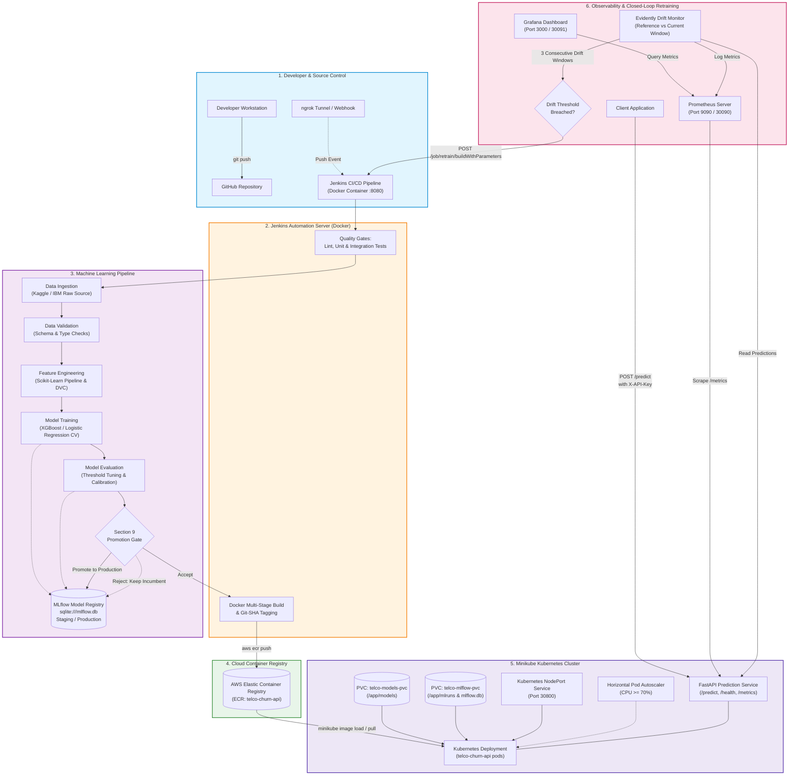
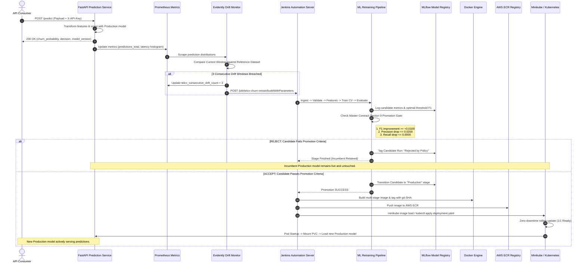

# Telco Customer Churn Prediction — Production MLOps Platform

[](Jenkinsfile)
[](pyproject.toml)
[](Dockerfile)
[](docs/COST_REPORT.md)
[](infra/k8s/)
[](infra/monitoring/)
[](LICENSE)

An enterprise-grade, end-to-end Machine Learning Operations (MLOps) platform predicting customer churn in telecommunications. The system automates data ingestion, schema validation, feature engineering with DVC tracking, deterministic hyperparameter search with 5-fold cross-validation, threshold optimization along Precision-Recall curves, MLflow Model Registry governance, hardened multi-stage Docker containerization, AWS ECR publishing, local Kubernetes (Minikube) deployment with autoscaling, Prometheus/Grafana real-time telemetry, Evidently AI drift monitoring, and closed-loop automated retraining.

---

## 1. System Architecture



> [!NOTE]
> **Deployed Infrastructure Scope**:
> This platform executes on a local **Minikube Kubernetes cluster** backed by **Jenkins in Docker** and **AWS Elastic Container Registry (ECR)** for container image distribution. **AWS EC2 was NOT used as a deployed runtime environment.**

---

## 2. Closed-Loop Retraining & Redeployment Flow



---

## 3. Quickstart & Fresh-Clone Setup

Follow these steps to set up the complete developer environment on a fresh clone.

### Prerequisites

| Tool | Minimum Version | Verification Command | Purpose |
|---|---|---|---|
| **Python** | `3.12.0+` (64-bit) | `py -3.12 --version` or `python --version` | Runtime environment |
| **Git** | `2.30+` | `git --version` | Source control |
| **Docker Desktop** | `24.0+` | `docker info` | Container runtime & Jenkins |
| **Minikube** | `v1.30+` | `minikube status` | Local Kubernetes cluster |
| **kubectl** | `v1.28+` | `kubectl version --client` | Cluster CLI management |
| **AWS CLI** | `v2.10+` | `aws sts get-caller-identity` | ECR repository interactions |

---

### Step-by-Step Installation

#### 1. Clone the Repository
```powershell
git clone https://github.com/aakash1552005/telco-churn-mlops.git
cd telco-churn-mlops
```

#### 2. Create Virtual Environment & Install Dependencies
```powershell
# Create Python 3.12 virtual environment
py -3.12 -m venv .venv

# Activate the virtual environment
.\.venv\Scripts\Activate.ps1

# Install core and development dependencies via tasks.py
py -3.12 tasks.py install
```

#### 3. Environment Configuration
If `.env` is absent, the system automatically falls back to `.env.example`. You can initialize your local configuration file:
```powershell
Copy-Item .env.example .env
```

---

## 4. Automation & Quality Gates (`tasks.py`)

The project uses a pure Python cross-platform task runner ([`tasks.py`](tasks.py)) replacing non-portable `Makefile` targets.

| Command | Action | Description |
|---|---|---|
| `py -3.12 tasks.py install` | Dependency Setup | Installs editable package (`.[dev,test]`) & pre-commit hooks |
| `py -3.12 tasks.py lint` | Code Quality Gate | Runs bare `print()` checks, `flake8`, `black --check`, `isort --check-only`, `mypy` |
| `py -3.12 tasks.py format` | Auto-Formatting | Formats all code using `isort` and `black` |
| `py -3.12 tasks.py test` | Unit Tests | Executes full pytest suite (88 passing tests) |
| `py -3.12 tasks.py integration-test` | Integration Suite | Runs hermetic end-to-end integration suite (`tests/integration/test_end_to_end.py`) |
| `py -3.12 tasks.py ingest` | Data Ingestion | Downloads raw dataset, verifies SHA-256 checksum, updates DVC tracking |
| `py -3.12 tasks.py validate` | Data Validation | Validates 21 columns against schema rules, outputs `reports/validation_report.json` |
| `py -3.12 tasks.py features` | Feature Pipeline | Fits Scikit-Learn transformer on `X_train`, saves `data/processed/` & `models/feature_pipeline.joblib` |
| `py -3.12 tasks.py train` | Model Training | Executes 5-fold Stratified CV on XGBoost & Logistic Regression, saves `models/best_model.joblib` |
| `py -3.12 tasks.py evaluate` | Evaluation & Tuning | Optimizes decision threshold ($\approx 0.3254$), generates 6 plots in `reports/plots/` |
| `py -3.12 tasks.py promote` | Model Promotion | Evaluates Section 9 criteria, registers model, and promotes to Production in `sqlite:///mlflow.db` |
| `py -3.12 tasks.py drift` | Drift Monitoring | Computes Evidently drift metrics comparing reference vs current window |
| `py -3.12 tasks.py trigger` | Retraining Webhook | Sends parameter payload to Jenkins REST API when 3 consecutive drift windows are breached |
| `py -3.12 tasks.py serve` | API Server | Starts local Uvicorn development server at `http://127.0.0.1:8000` |
| `py -3.12 tasks.py docker-build` | Container Build | Builds hardened multi-stage Docker image tagged `telco-churn-api:latest` |
| `py -3.12 tasks.py clean` | Cleanup | Deletes cache files (`__pycache__`, `.mypy_cache`, `.pytest_cache`) |

---

## 5. Docker Containerization & AWS ECR Pipeline

### Local Container Build & Test
```powershell
# Build multi-stage Docker image
py -3.12 tasks.py docker-build

# Run container locally with health checks
docker run -d --name telco-api -p 8000:8000 -e API_SECRET_KEYS='["dev-secret-key-1"]' telco-churn-api:latest

# Verify health probe
curl http://localhost:8000/health/liveness
```

### AWS ECR Provisioning & Image Push
```powershell
# 1. Provision ECR repository (once only)
.\infra\aws\create_ecr_repo.ps1

# 2. Tag and push immutable image (tagged with latest and git-SHA)
.\infra\aws\push_to_ecr.ps1
```

---

## 6. Kubernetes (Minikube) Deployment

Manifests are organized in `infra/k8s/` and follow production-aligned practices (resource limits, liveness/readiness probes, PVC storage mounts, HPA, and PDB):

```powershell
# 1. Start Minikube cluster
minikube start --driver=docker

# 2. Load Docker image into Minikube runtime
minikube image load 899640267680.dkr.ecr.ap-south-1.amazonaws.com/telco-churn-api:<GIT-SHA>

# 3. Create real API authentication secret
kubectl create secret generic telco-churn-secret `
  --from-literal=API_SECRET_KEYS='["your-secure-api-key"]' `
  --dry-run=client -o yaml | kubectl apply -f -

# 4. Deploy PVCs and populate model artifacts
kubectl apply -f infra/k8s/pvc-models.yaml
kubectl apply -f infra/k8s/pvc-mlflow.yaml

# Copy models/ to telco-models-pvc using a temporary helper pod
kubectl run pvc-init --image=busybox --restart=Never `
  --overrides='{"spec":{"volumes":[{"name":"m","persistentVolumeClaim":{"claimName":"telco-models-pvc"}}],"containers":[{"name":"c","image":"busybox","command":["sh","-c","sleep 3600"],"volumeMounts":[{"name":"m","mountPath":"/mnt"}]}]}}' -- sh -c "sleep 3600"
kubectl wait --for=condition=Ready pod/pvc-init --timeout=60s
kubectl cp models/. pvc-init:/mnt/
kubectl delete pod pvc-init

# 5. Apply Deployment, Service, ConfigMap, HPA, and PDB
kubectl apply -f infra/k8s/configmap.yaml
kubectl apply -f infra/k8s/deployment.yaml
kubectl apply -f infra/k8s/service.yaml
kubectl apply -f infra/k8s/hpa.yaml
kubectl apply -f infra/k8s/pdb.yaml

# 6. Verify rollout
kubectl rollout status deployment/telco-churn-api
```

### Making a Live Prediction
```powershell
# Get service NodePort URL
$API_URL = $(minikube service telco-churn-api --url)

# Send inference request with X-API-Key header
curl -X POST "$API_URL/predict" `
  -H "Content-Type: application/json" `
  -H "X-API-Key: your-secure-api-key" `
  -d '{
    "customerID": "7590-VHVEG",
    "gender": "Female",
    "SeniorCitizen": 0,
    "Partner": "Yes",
    "Dependents": "No",
    "tenure": 1,
    "PhoneService": "No",
    "MultipleLines": "No phone service",
    "InternetService": "DSL",
    "OnlineSecurity": "No",
    "OnlineBackup": "Yes",
    "DeviceProtection": "No",
    "TechSupport": "No",
    "StreamingTV": "No",
    "StreamingMovies": "No",
    "Contract": "Month-to-month",
    "PaperlessBilling": "Yes",
    "PaymentMethod": "Electronic check",
    "MonthlyCharges": 29.85,
    "TotalCharges": "29.85"
  }'
```

---

## 7. Observability & Monitoring

### Prometheus & Grafana Setup
```powershell
# Deploy Prometheus server & scrape configs
kubectl apply -f infra/monitoring/prometheus-configmap.yaml
kubectl apply -f infra/monitoring/prometheus-deployment.yaml
kubectl apply -f infra/monitoring/prometheus-service.yaml

# Deploy Grafana with auto-provisioned dashboards
kubectl apply -f infra/monitoring/grafana-deployment.yaml
kubectl apply -f infra/monitoring/grafana-service.yaml
```

- **Prometheus UI**: `http://<minikube-ip>:30090`
- **Grafana Dashboard**: `http://<minikube-ip>:30091` (Credentials: `admin` / `admin`)

---

## 8. Project Documentation & Governance Index

| Document | Description |
|---|---|
| [**Architecture Decisions (ADR Catalog)**](docs/adr/README.md) | Index of all 6 formal ADRs (Tasks, Pydantic type safety, Training strategy, Threshold optimization, MLflow promotion, Integration isolation). |
| [**System Architecture Diagram**](docs/diagrams/architecture.md) | Detailed architecture diagram and subsystem components in Mermaid format. |
| [**Closed-Loop Sequence Diagram**](docs/diagrams/sequence.md) | Sequence diagram modeling inference, drift detection, Jenkins triggers, and rolling redeployment. |
| [**AWS Cost & Expenditure Report**](docs/COST_REPORT.md) | Cloud financial audit covering actual AWS billed usage, ECR storage deduplication, and AutoPay mandate limits. |
| [**Infrastructure Teardown Guide**](docs/TEARDOWN_GUIDE.md) | Step-by-step decommission guide for Minikube, Jenkins containers, ECR repositories, and local environments. |
| [**Final Acceptance Report & Section 13 Audit**](docs/FINAL_ACCEPTANCE_REPORT.md) | Complete line-by-line acceptance matrix auditing all 13 sections of the project Master Contract. |
| [**Project Progress Log**](PROJECT_PROGRESS.md) | Comprehensive milestone tracker and phase verification log across all 20 phases. |

---

## 9. Known Limitations

1. **Synthetic Current-Window Drift Detection**: Synthetic perturbation is used for deterministic local and CI drift testing; production streaming architectures would ingest live Kafka/Kinesis streams.
2. **Local File-State Monitoring Persistence**: Drift state machine window counts persist to `reports/drift_state.json` via local file locks rather than distributed Redis instances.
3. **Grafana Development Credentials**: Basic auth (`admin`/`admin`) is configured for local Minikube developer access and should be replaced with corporate SSO in cloud production.
4. **Single-Node Minikube Runtime**: Minikube provides a local single-node cluster with `hostPath` storage rather than multi-zone high-availability cloud storage.
5. **Local MLflow SQLite Tracking**: MLflow tracking uses local SQLite (`sqlite:///mlflow.db`) rather than a managed multi-AZ Amazon RDS PostgreSQL instance.
