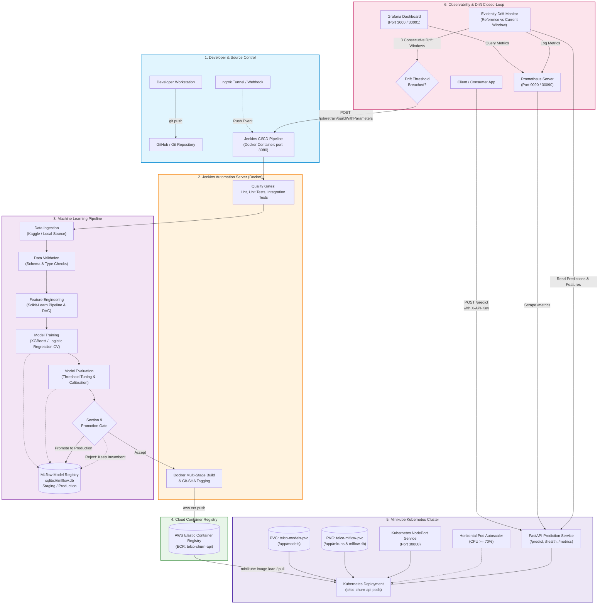

# System Architecture Diagram

This document contains the complete, reproducible system architecture diagram for the **Telco Customer Churn MLOps Platform**.

---

## High-Level Architecture Overview

The system is organized into five tightly integrated subsystems:
1. **Developer / Continuous Integration**: Git push triggers Jenkins CI/CD automation.
2. **ML Lifecycle Pipeline**: Ingestion, validation, feature engineering, deterministic cross-validation training, threshold optimization, and promotion policy gating against local SQLite MLflow Model Registry.
3. **Container & Cloud Registry**: Multi-stage hardened Docker image pinned with git-SHA digests pushed to private AWS Elastic Container Registry (ECR).
4. **Kubernetes Runtime**: Local Minikube Kubernetes cluster running FastAPI prediction pods, PVC mounts, HPA autoscaling, and NodePort exposure.
5. **Observability & Closed-Loop Retraining**: Real-time Prometheus metrics scraping, Grafana dashboards, Evidently drift detection, and automated webhook triggers back to Jenkins.

---

## Architecture Diagram (Mermaid Source)

---

## Subsystem Descriptions

| Subsystem | Components | Technology Stack | Key Responsibilities |
|---|---|---|---|
| **Source & Orchestration** | Git, ngrok, Jenkins | Git, Docker, Jenkins LTS | Version control, webhook routing, automated pipeline execution, build verification. |
| **ML Lifecycle** | Ingestion, Validation, Features, Training, Evaluation, Promotion | Pandas, Scikit-learn, XGBoost, DVC, MLflow (SQLite) | Deterministic training with 5-fold CV, optimal threshold tuning ($\approx 0.3254$), Section 9 promotion policy enforcement. |
| **Container & Cloud Registry** | Docker, AWS ECR | Docker BuildKit, AWS CLI, ECR | Multi-stage image build, non-root `appuser` execution, immutable git-SHA digest tagging, AWS ECR push. |
| **Cluster Runtime** | Minikube, Kubernetes manifests | Minikube, kubectl, Kubernetes v1.30+ | Local cluster deployment, PVC artifact mounting, rolling updates, HPA auto-scaling, NodePort routing. |
| **Inference Service** | FastAPI, Uvicorn, SlowAPI | FastAPI, Pydantic v2, Python 3.12 | REST prediction endpoints (`/predict`), health probes (`/health/liveness`, `/health/readiness`), API key auth, rate limiting. |
| **Observability & Closed Loop** | Prometheus, Grafana, Evidently | Prometheus, Grafana, Evidently AI | Telemetry scraping, visual performance dashboards, data drift monitoring, automated retraining trigger. |
