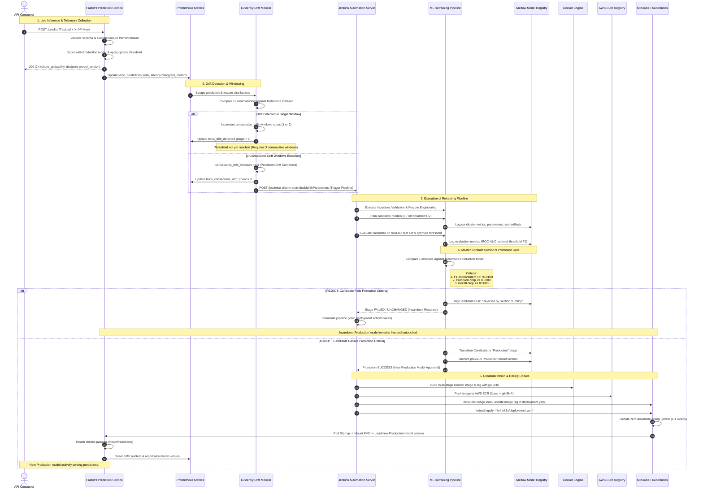

# Closed-Loop Retraining & Redeployment Sequence Diagram

This document contains the sequence diagram modeling the real closed-loop feedback mechanism of the **Telco Customer Churn MLOps Platform**, spanning inference telemetry, drift detection windowing, Jenkins retraining triggers, Section 9 promotion policy gating, and Kubernetes rolling deployment.

---

## Retraining & Deployment Lifecycle Sequence (Mermaid Source)

---

## Key Sequence Decision Points

1. **Windowed Drift Dampening**: Prevents thrashing by requiring **3 consecutive drifted windows** before initiating heavy compute retraining.
2. **Deterministic Promotion Gate**: The candidate model MUST strictly demonstrate:
   - $\Delta \text{F1} \ge +0.0100$
   - $\Delta \text{Precision} \ge -0.0200$
   - $\Delta \text{Recall} \ge 0.0000$
3. **Safe Rejection Fallback**: If a retrained candidate fails the gate, the pipeline exits safely without mutating the live Kubernetes cluster or the incumbent Production model.
4. **Zero-Downtime Rolling Update**: Upon passing the gate, the image is pushed to ECR and rolled out on Kubernetes with liveness/readiness probes ensuring no dropped requests.
